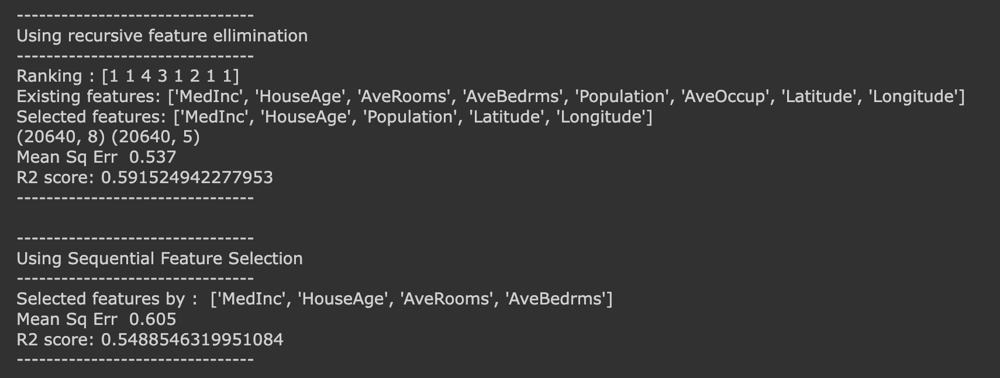

<!--  -->

# California Housing Dataset Feature Selection Analysis

This repository contains the analysis of the California housing dataset. It demonstrates the use of various techniques for feature selection and the evaluation of a linear regression model on the selected features.

## Features

    - Data Analysis: The project performs exploratory data analysis on the California housing dataset to understand the patterns and relationships in the data.

    - Linear Regression: Linear regression is employed to build a predictive model for housing prices based on various features present in the dataset.

    - Scikit-learn Library: The project leverages the scikit-learn library to implement the linear regression model, handle data preprocessing, and evaluate the model's performance.

## File Structure

    - california_feature_selection.ipynb: Jupyter Notebook containing the code for feature selection.

    - result/: Directory containing the plots generated

    - README.md: Project documentation providing an overview, usage instructions, and other relevant information.
# California Housing Price Prediction

This Python project is a continuation of earlier project which predicts housing prices using linear regression as the machine learning technique. Here we go over various techniques in scikit-learn library for feature selection : mutual_info_regression, SelectPercentile and SelectKBest etc. and calculates r2 score of each of those.

## Dataset Description
--------------------------

**Data Set Characteristics:**

    :Number of Instances: 20640

    The dataset includes the following features:

    - Longitude
    - Latitude
    - MedInc (median income in block)
    - HouseAge (median house age in block)
    - AveRooms (average number of rooms)
    - AveBedrms (average number of bedrooms)
    - Population (block population)
    - AveOccup (average house occupancy)
    - Latitude: Longitude
    - MedianHouseValue
    - ApartmentOccupancy:

The target variable is the median house value for California districts,
expressed in hundreds of thousands of dollars ($100,000).

## Lessons Learned

### why feature selection?
    1. Reducing Dimensionality: By selecting the most important features,we can reduce the number of dimensions in our dataset. 
        This helps to avoid the curse of dimensionality

    2. Improving Model Interpretability: When a model relies on many features, it can be challenging to interpret its results.  By selecting only the most 
        important features.We can simplify our model and make it easier to understand.

    3. Reducing Computational Complexity: Selecting the most important features can help reduce the amount of data which in 
        turn speeds up the training and prediction processes
    

### Important concepts in feature selection process

# Filter based methods : 
These are faster and computationally less expensive.

    1. Mutual info regression: used for regression problem,  It works by measuring the dependency between each feature and the target variable. 
            In our case, mutual information is calculated between each of above 10 listed features against the target variable,  median house value. 

    2. SelectPercentile: This feature selection method is used to select a subset of features that have the highest scores according to a scoring
            function. In this project we used mutual_info_regression and f_regression as a scoring function. 

    3. SelectKBest: This feature selection method is also used to select a subset of features that have the highest scores according to a scoring 
            function, mutual_info_regression in this project.

# Wrapper based methods : 
Train a model on different subsets of features, and select the best one. This is computationally expensive operation.

     1. Recurive Feature Elimination (RFS): start by training with all features and recusively remove one feature at a time. (Do you really read this? :)
     2. Sequential Feature Selection (SFS): selection starts with one feature, and in each subsequent step, one more feature is added.
                             In comparision to the RFS, this offers simplicity and speed.
     

## Observations
          Based on R2 scores for each of the technique mentioned above. Though the result mostly similar, the techniques to derive those are pretty different from each other.

